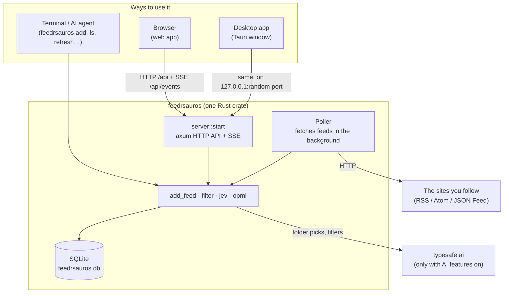
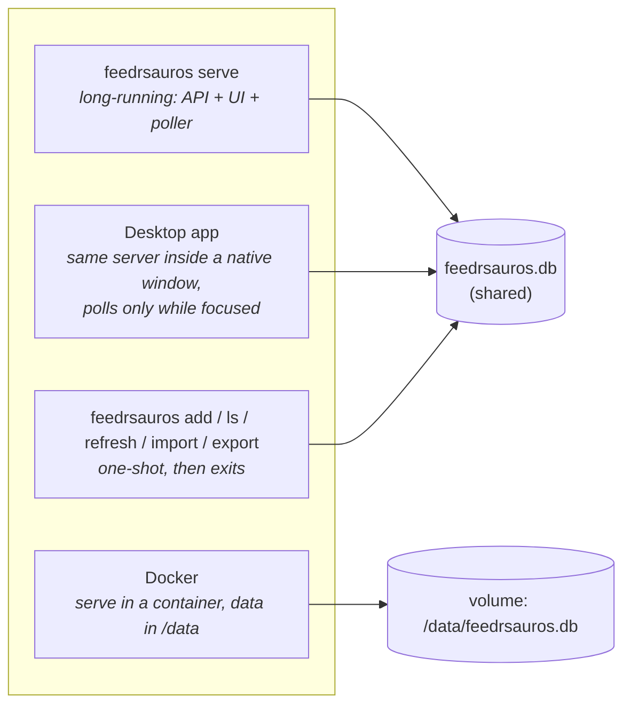
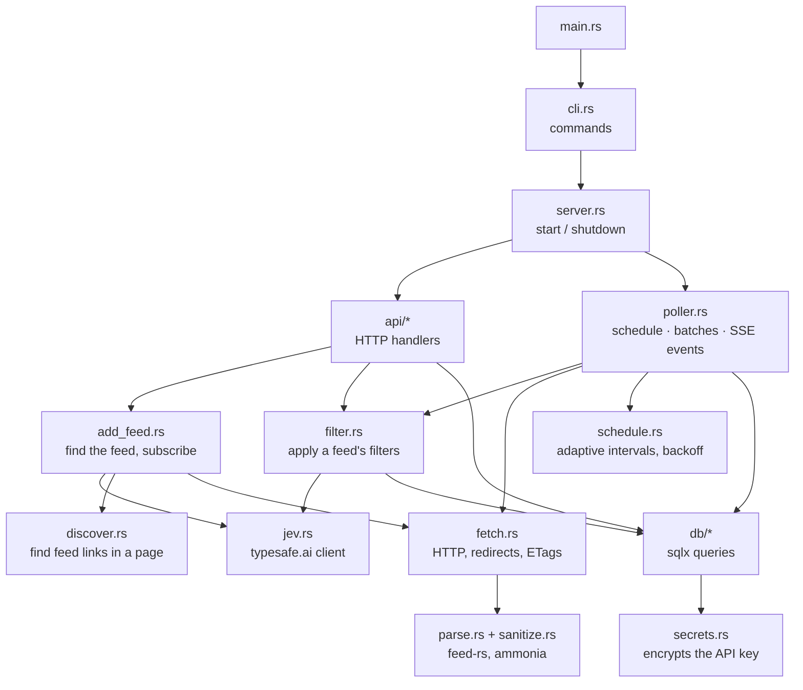
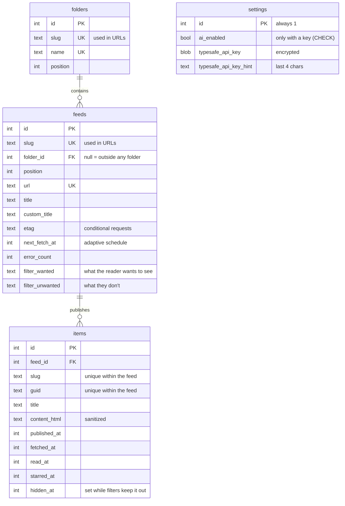
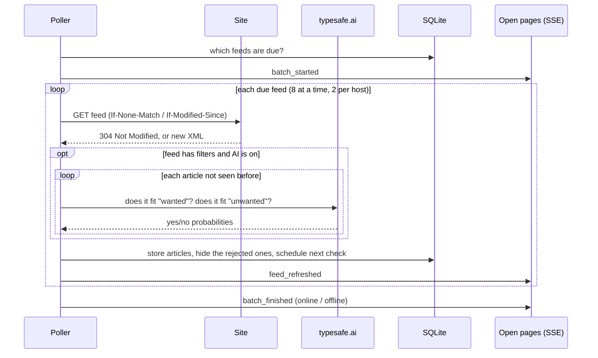
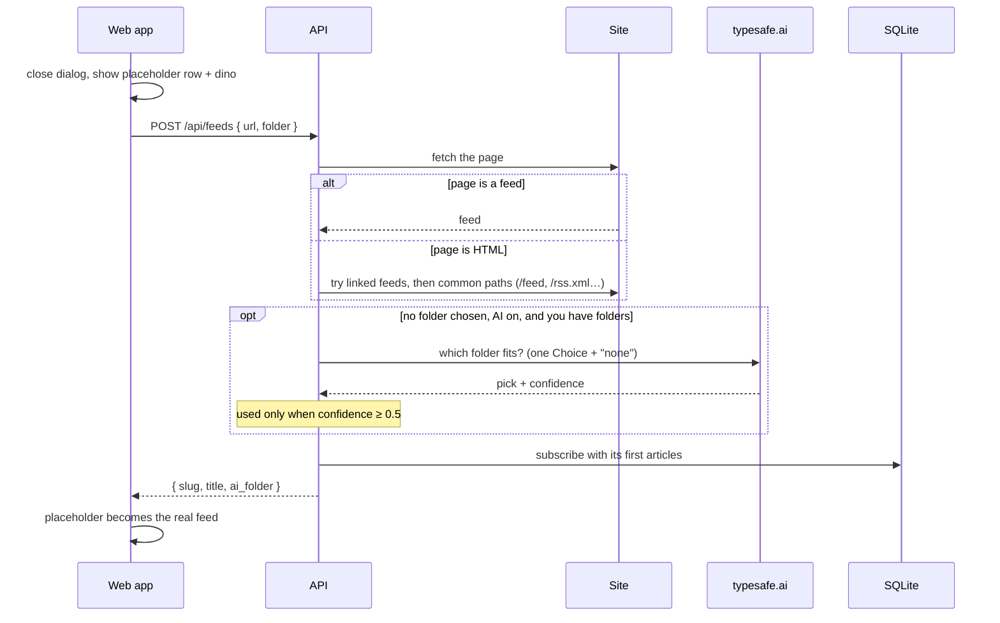
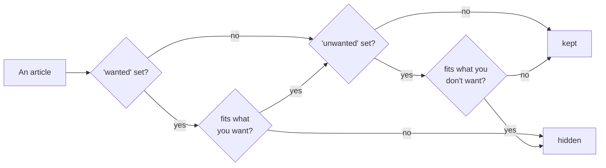
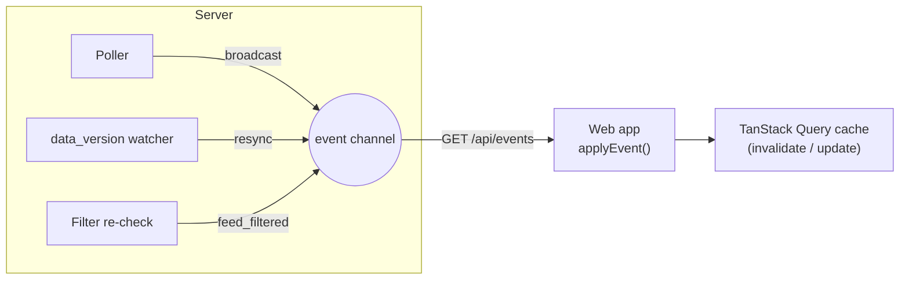
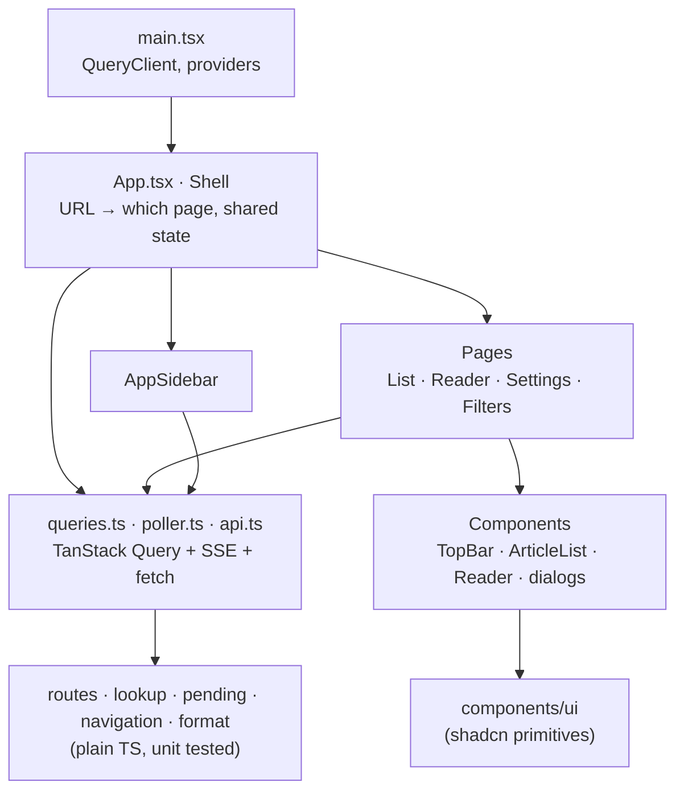
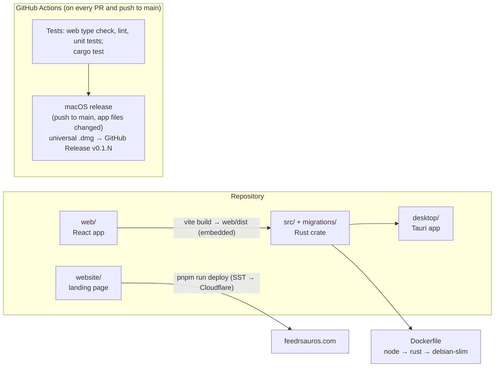

# feedrsauros architecture

A local-first RSS reader. One Rust program owns the data and does all the work; everything you look at is a React app talking to it over HTTP.

## The big picture

- **One backend, many front doors.** The browser, the desktop app and the CLI all run the same Rust code against the same SQLite file.
- **The web app is embedded** in the Rust binary (`web/dist` via `rust-embed`), so `feedrsauros serve` serves both the API and the UI.
- **Nothing leaves your machine** except fetching feeds, favicons, and, only if you turn AI features on, one request per judgment to typesafe.ai.

## Ways it runs

| Mode | Polls feeds? | Notes |
|---|---|---|
| `feedrsauros serve` | Yes, always | For the browser and self-hosting. `--host`, `--port`, `--open`. |
| Desktop app | Only while its window is focused | Starts the server on a random localhost port. |
| Docker | Yes | `docker compose up -d`, port `127.0.0.1:7777`. |
| CLI commands | No | Do one thing and exit. |

**Running several at once is safe:**
- Only one process polls a database file at a time, thanks to a lock file (`feedrsauros.db.poller.lock`).
- Each server checks SQLite's `data_version` every second. When another process has written, it tells its pages to reload.
- So a feed added from the CLI shows up in the open desktop app.

## Backend modules

| Module | Job |
|---|---|
| `cli.rs` | Command-line parsing; picks the database path (platform data directory, or `--db` / `FEEDRSAUROS_DB`). |
| `server.rs` | Starts the API and poller together; shuts both down cleanly. Shared by `serve` and the desktop app. |
| `api/` | One file per resource: `feeds`, `folders`, `items`, `filters`, `settings`, `opml`, `events` (SSE), `web` (serves the UI). |
| `poller.rs` | Decides which feeds are due, fetches them in batches, stores results, broadcasts events. |
| `schedule.rs` | How often to check each feed: often for busy sites, rarely for quiet ones, backing off on errors. |
| `fetch.rs` | HTTP with conditional requests (ETag / Last-Modified), manual redirects, timeouts. |
| `parse.rs`, `sanitize.rs` | Turn RSS/Atom/JSON Feed into articles; clean their HTML. |
| `add_feed.rs`, `discover.rs` | Turn "a website address" into a subscription. |
| `filter.rs` | Filters: what a feed's articles should look like, and hiding/showing them. |
| `jev.rs` | The only code that talks to typesafe.ai. |
| `secrets.rs` | ChaCha20-Poly1305 encryption for the API key. |
| `db/` | All SQL, checked against the schema at compile time (`sqlx::query!`). |

## Data model

- **Slugs in URLs, integer ids internally.** Integer ids never appear in the API's JSON.
- **Hidden, never deleted:** filtered-out articles keep their row with `hidden_at` set. Lists, unread counts and mark-all-read skip them.
- **The database enforces the rules it can:** AI can't be on without a key, and a blank filter text is stored as "no filter".
- **Next to the database:** the encryption key (`feedrsauros.db.key`, readable only by you) and the poller lock.

## How new articles arrive

- **Offline detection:** if nothing answers, including a feed known to be healthy, the problem is your connection. Failures are postponed instead of counted against the feeds.
- **Each article is judged once, on arrival.** If typesafe.ai can't be reached, the article is kept.

## Adding a site

## Filters

Each feed can have two plain-language texts: **What do you want to see?** and **What don't you want to see?**

- **One request per article**, with one yes/no question per filled-in text.
- **Changing a feed's filters** re-judges every stored article in it, hidden ones too, four at a time in the background. Whatever the new verdict differs for is hidden or brought back.
- **Clearing both texts** brings everything back without any requests.
- **Starred articles** are never hidden.
- **When it's done**, a `feed_filtered` event tells open pages to reload.

## Live updates (SSE)

| Event | The web app… |
|---|---|
| `batch_started` / `batch_finished` | shows or stops the refresh spinner; reloads lists when done |
| `feed_refreshed` / `feed_failed` | reloads the sidebar counts |
| `feed_filtered` | reloads the sidebar and lists |
| `resync` | reloads everything (another process wrote, or the page fell behind) |

## Frontend

React 19 + TypeScript, built with Vite, styled with Tailwind + shadcn/ui.

- **Server data lives in TanStack Query:** the sidebar, lists, an article, settings, filters, the poller status, and even localStorage preferences.
- **Mutations update the page immediately and roll back on error:** starring, reading, adding a feed.
- **Routes:**

  | Path | Page |
  |---|---|
  | `/` | All articles |
  | `/unread`, `/starred` | Unread, Starred |
  | `/folders/:folder` | A folder |
  | `/feeds/:feed` | A feed |
  | `/feeds/:feed/:article` | An open article |
  | `/filters/:feed` | A feed's filters |
  | `/settings` | Settings |

## HTTP API

| Method & path | What it does |
|---|---|
| `GET /api/sidebar` | Folders, feeds, unread and starred counts |
| `POST /api/folders` · `PATCH/DELETE /api/folders/:slug` · `PUT …/position` | Create, rename, delete, reorder folders |
| `POST /api/feeds` · `DELETE /api/feeds/:slug` | Subscribe (with AI filing), unsubscribe |
| `PUT /api/feeds/:slug/position` · `PUT …/title` | Move, rename a feed |
| `GET/PUT /api/feeds/:slug/filters` | Read or change a feed's filters |
| `GET /api/items?feed=&folder=&starred=&unread=&cursor=` | Article lists, paged |
| `GET/PATCH /api/feeds/:feed/items/:item` | Open an article; mark read or starred |
| `POST /api/items/mark-read` | Mark everything seen so far as read |
| `POST /api/refresh` | Fetch now (all, a folder, or a feed) |
| `GET/POST /api/opml` | Export or import subscriptions |
| `GET /api/settings` · `PUT/DELETE …/api-key` · `PUT …/ai` | AI settings; the key never comes back, only a hint |
| `GET /api/events` | Server-sent events |

## Security and privacy

- **No login.** It listens on `127.0.0.1` by default. To reach it from other devices, put it behind a VPN or an authenticating reverse proxy.
- **API key:** encrypted with ChaCha20-Poly1305 under a key file kept *next to* the database. A copy of the database alone doesn't reveal the key.
- **Article HTML** is sanitized with `ammonia` before it's stored.
- **Desktop app:** links to other sites open in your normal browser. The page may only drag and zoom the window, nothing else native.

## Repository and delivery

- **Releases:** every push to `main` that changes the app builds a universal (Apple Silicon + Intel) `.dmg` and publishes `v<major.minor>.<run number>`, attached as `feedrsauros.dmg`.
